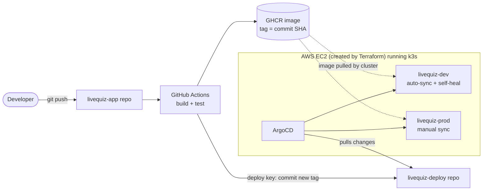
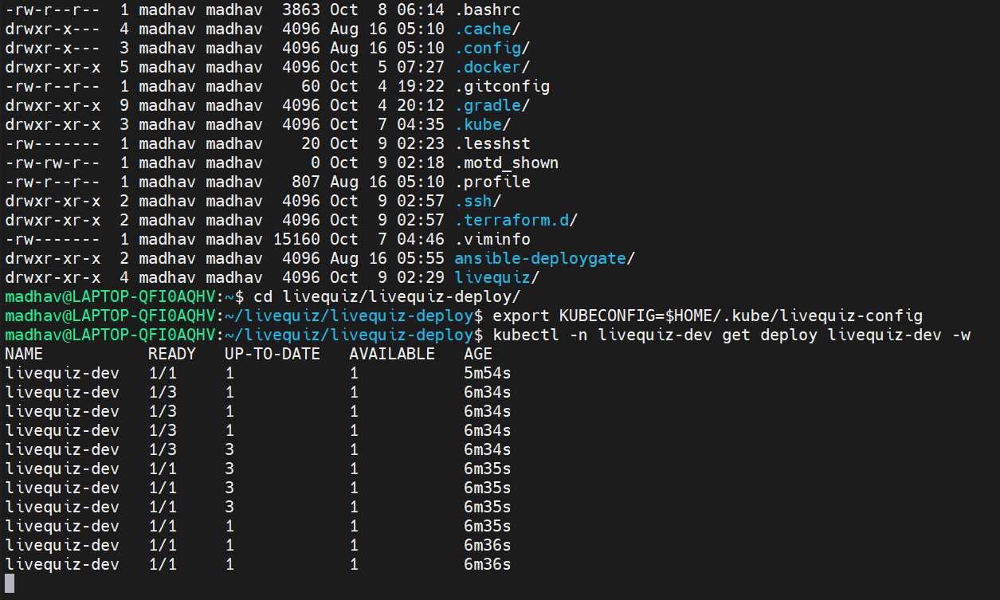
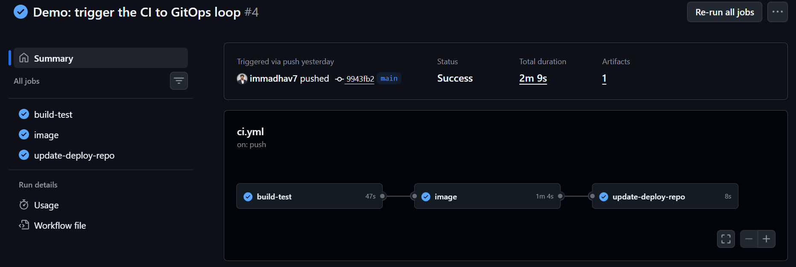
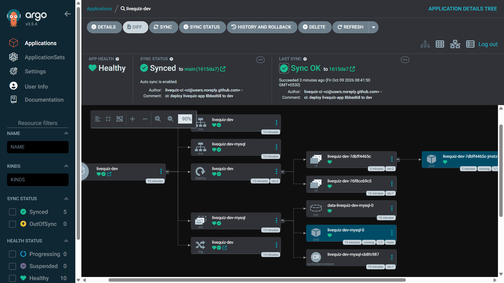
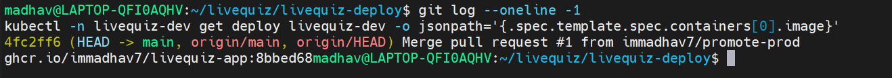
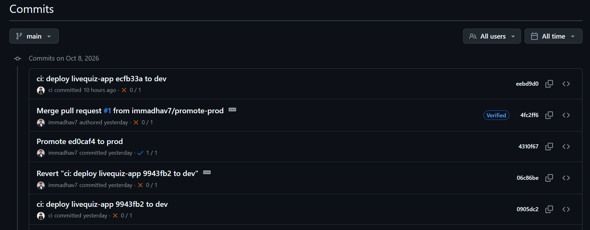
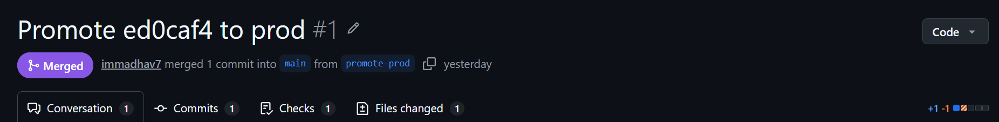
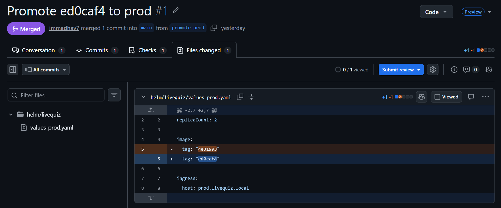
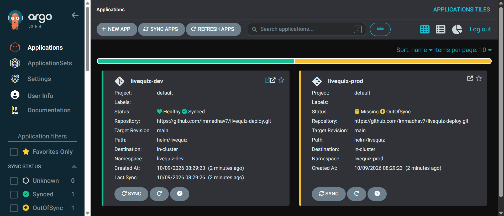
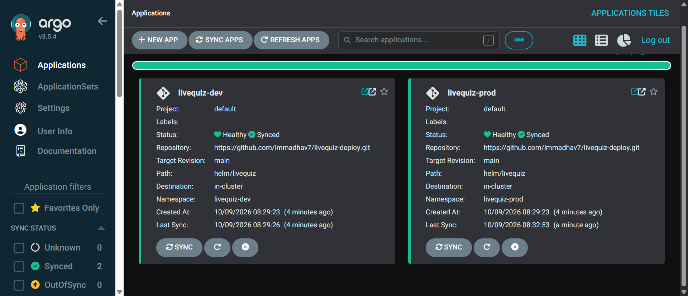

# LiveQuiz Delivery Platform

A GitOps delivery pipeline for a small quiz application: GitHub Actions CI, Docker images in GHCR, Terraform-provisioned AWS server running k3s, a self-written Helm chart, and ArgoCD for deployments to dev and prod.

The application is intentionally simple. **The project is the platform that builds, ships and runs it.**

- App repo: https://github.com/immadhav7/livequiz-app
- This repo (deploy repo): Helm chart, ArgoCD applications, Terraform, helper scripts

## Architecture



**Flow**

1. A push to `livequiz-app` runs CI: build and test, then build and push the image tagged with the first 7 characters of the commit SHA.
2. CI commits the new tag to `helm/livequiz/values-dev.yaml` in this repo, using a deploy key limited to this one repo.
3. ArgoCD, running inside the cluster, notices the commit and rolls out dev automatically.
4. Prod changes only through a reviewed pull request that copies the tag into `values-prod.yaml`, followed by a manual Sync in ArgoCD.

## Design decisions

| Decision | Reason |
|---|---|
| Two repos (app and deploy) | CI changes only the deploy repo; ArgoCD watches only the deploy repo. |
| CI never touches the cluster | CI holds only a deploy key for one repo; the cluster pulls changes itself. |
| SHA image tags, never `latest` | Every deployment traces to one commit; rollback is a `git revert`. |
| Dev auto-sync with self-heal, prod manual sync | Dev is fast; prod needs a reviewed change and a human approval. |
| DB passwords in a pre-created Kubernetes Secret | Passwords never enter Git (see limitations). |
| Init container, probes, requests/limits | No crash loops at startup, traffic only to ready pods, fair scheduling. |
| Security group open to one IP, IMDSv2, encrypted disk | Least exposure for a demo server. |
| Terraform plus a teardown script | The whole environment is rebuilt from code in about 10 minutes and destroyed after each session. |

## Repository layout

```
helm/livequiz/        Helm chart (values.yaml, values-dev.yaml, values-prod.yaml, templates/)
argocd/               ArgoCD Application manifests (app-dev.yaml, app-prod.yaml)
terraform/            EC2 + security group + key pair, k3s installed through user_data.sh
scripts/              rebuild.sh, teardown.sh, get-kubeconfig.sh, argocd-ui.sh, smoke-test.sh
```

## Stack

| Layer | Choice |
|---|---|
| Application | Spring Boot 4.1.1, Java 21, Gradle, MySQL 8.4 |
| Container | Multi-stage Dockerfile, non-root user, healthcheck |
| CI | GitHub Actions (build-test, image, update-deploy-repo) |
| Registry | GitHub Container Registry |
| Infrastructure | Terraform on AWS EC2 (ap-south-2), Ubuntu 24.04, k3s |
| Packaging | Helm chart written from scratch |
| Delivery | ArgoCD |

## Demos

Each demo below was run on the real environment.

### 1. Drift correction (self-heal)
Scaling the dev deployment by hand to 3 replicas (`kubectl scale`) is detected by ArgoCD and reverted to the 1 replica declared in Git.



### 2. Live pipeline
A push to the app repo produces three green CI jobs, a `livequiz-ci` commit in this repo, and a rolling update of the dev pod to the new image.





### 3. Rollback
`git revert` on the CI commit returned dev to the previous image tag, with no cluster access needed.



### 4. Promotion to prod through a pull request
The dev tag was copied into `values-prod.yaml` on a `promote-prod` branch and merged through PR #1. Prod then showed OutOfSync until a manual Sync.






## Running it

Requires the AWS CLI, Terraform, kubectl and an SSH key pair. A running server costs money, so always tear it down.

```
scripts/rebuild.sh        # server, k3s, ArgoCD, secrets, both apps (about 10 minutes)
scripts/argocd-ui.sh      # port-forward; UI at https://localhost:8081, user admin
scripts/smoke-test.sh     # checks dev and prod health through the Ingress
scripts/teardown.sh       # destroy everything
```

Each new terminal needs `export KUBECONFIG=$HOME/.kube/livequiz-config`.

## Known limitations and what I would improve

- **Secrets:** the database Secret is created by a script. Production would use External Secrets or Sealed Secrets.
- **Network:** the server sits in the default VPC with a public IP. A custom VPC with private subnets would be the next step.
- **Terraform state:** local state. It should live in S3 with locking.
- **Prod approval:** the PR is reviewed by convention. Branch protection with required reviewers would enforce it.
- **ArgoCD version:** installed from the stable manifest; it should be pinned.
- **Database:** `ddl-auto=update` should be replaced by Flyway migrations, and tests should use Testcontainers with real MySQL instead of H2.
- **Scaling and observability:** add an HPA with a load test, and monitoring with Prometheus and Grafana.

## About the application code

The LiveQuiz application code was written with AI assistance. The delivery platform in this repo (pipeline, Terraform, Helm chart, GitOps setup, scripts) is the focus of the project.
